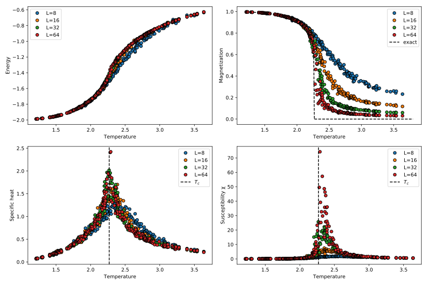

# Examples

## 2D Ising model

**Results:**


**Code:**
```julia
using MonteCarlo, Distributions, PyPlot, DataFrames, JLD

Tdist = Normal(MonteCarlo.IsingTc, .64)
n_Ts = 2^8
Ts = sort!(rand(Tdist, n_Ts))
Ts = Ts[Ts.>=1.2]
Ts = Ts[Ts.<=3.8]
therm = 10^4
sweeps = 10^3

df = DataFrame(L=Int[], T=Float64[], M=Float64[], χ=Float64[], E=Float64[], C_V=Float64[])

for L in 2.^[3, 4, 5, 6]
	println("L = ", L)
	for (i, T) in enumerate(Ts)
		println("\t T = ", T)
		beta = 1/T
		model = IsingModel(dims=2, L=L)
		mc = MC(model, beta=beta)
		run!(mc, sweeps=sweeps, thermalization=therm, verbose=false)
		push!(df, [L, T, mean(mc.obs["m"]), mean(mc.obs["χ"]), mean(mc.obs["e"]), mean(mc.obs["C"])])
	end
	flush(STDOUT)
end

sort!(df, cols = [:L, :T])
@save "ising2d.jld" df

# plot results together
grps = groupby(df, :L)
fig, ax = subplots(2,2, figsize=(12,8))
for g in grps
	L = g[:L][1]
	ax[1][:plot](g[:T], g[:E], "o", markeredgecolor="black", label="L=$L")
	ax[2][:plot](g[:T], g[:C_V], "o", markeredgecolor="black", label="L=$L")
	ax[3][:plot](g[:T], g[:M], "o", markeredgecolor="black", label="L=$L")
	ax[4][:plot](g[:T], g[:χ], "o", markeredgecolor="black", label="L=$L")
end
ax[1][:legend](loc="best")
ax[1][:set_ylabel]("Energy")
ax[1][:set_xlabel]("Temperature")

ax[2][:set_ylabel]("Specific heat")
ax[2][:set_xlabel]("Temperature")
ax[2][:axvline](x=MonteCarlo.IsingTc, color="black", linestyle="dashed", label="\$ T_c \$")
ax[2][:legend](loc="best")

ax[3][:set_ylabel]("Magnetization")
ax[3][:set_xlabel]("Temperature")
x = linspace(1.2, MonteCarlo.IsingTc, 100)
y = (1-sinh.(2.0 ./ (x)).^(-4)).^(1/8)
ax[3][:plot](x,y, "k--", label="exact")
ax[3][:plot](linspace(MonteCarlo.IsingTc, 3.8, 100), zeros(100), "k--")
ax[3][:legend](loc="best")

ax[4][:set_ylabel]("Susceptibility χ")
ax[4][:set_xlabel]("Temperature")
ax[4][:axvline](x=MonteCarlo.IsingTc, color="black", linestyle="dashed", label="\$ T_c \$")
ax[4][:legend](loc="best")
tight_layout()
savefig("ising2d.pdf")
```
