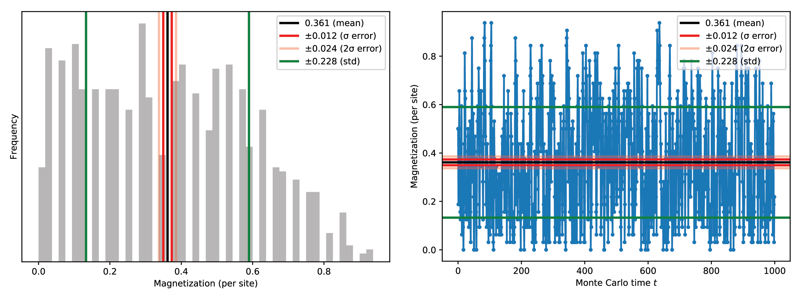

# Manual

## Installation / Updating

To install the package execute the following command in the REPL:
```julia
Pkg.clone("https://github.com/crstnbr/MonteCarlo.jl")
```

To obtain the latest version of the package just do `Pkg.update()` or specifically `Pkg.update("MonteCarlo")`.

## Usage

This is a simple demontration of how to perform a classical Monte Carlo simulation of the 2D Ising model:

```julia
# load packages
using MonteCarlo, MonteCarloObservable

# load your model
m = IsingModel(dims=2, L=8);

# choose a Monte Carlo flavor and run the simulation
mc = MC(m, beta=0.35);
run!(mc, sweeps=1000, thermalization=1000, verbose=false);

# analyze results
observables(mc) # what observables do exist for that simulation?
m = mc.obs["m"] # magnetization
mean(m)
std(m) # one-sigma error

# create standard plots
hist(m)
plot(m)
```



## Custom models

Probably the most important idea underlying the package design is extensibility. Users should be able to define custom physical models and utilize already implemented Monte Carlo flavors to study them. To that end all Monte Carlo flavors have rather well defined interfaces, that is specifications of mandatory and optional fields and methods, that the user must implement for any model that he wants to simulate. The definition of the interface for the above used classical Monte Carlo can for example be found here: [Monte Carlo](@ref). Practically, it is probably a good idea to start from a copy of one of the preimplemented models.

We hope that MonteCarlo.jl allows the user to put his focus on the physical model rather than having to tediously implement general Monte Carlo schemes.
